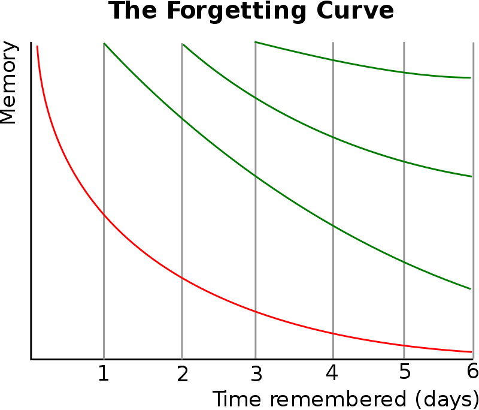
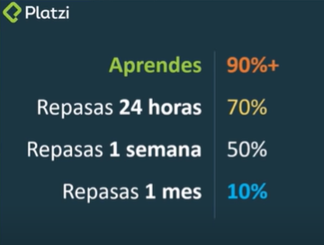
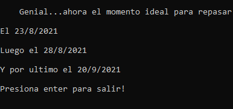

# Practica Espaciada

#### Una de las cosas más buscadas por los aprendices de una nueva diciplina, es el no olvidar lo aprendido con el pasar del tiempo.

## Esta curva del olvido descubierta por el psicólogo alemán Hermann Ebbinghaus

#### Ilustra la pérdida de retentiva con el tiempo, indica cuánto se mantiene un contenido en el cerebro.

#### Un gráfico típico de la curva del olvido muestra que normalmente en unos días o semanas se olvida la mitad de lo que hemos aprendido, a no ser que lo repasemos.

## La práctica espaciada

#### Para no olvidar lo que estamos aprendiendo debemos practicarlo en distintos intervalos de tiempo ¿Qué intervalos?

#### Cuando aprendes una cosa nueva tienes un 90% probabilidad de olvidar lo aprendido.
* Cuando repasar lo aprendido 24 horas después la probabilidad es del 70%
* Cuando repasar lo aprendido 1 semana después la probabilidad es del 50%
* Cuando repasar lo aprendido 1 mes después la probabilidad es del 10%

## ¿Qué hace este software?
#### Cuando ejecutes “Practica espaciada.exe” te preguntara:
* ¿Qué es lo que aprendiste el día de hoy?

#### Luego te dirá cual son los momentos exactos para repasar lo aprendido y así nunca volver a olvidarlo

### #NuncaParesDeAprender

